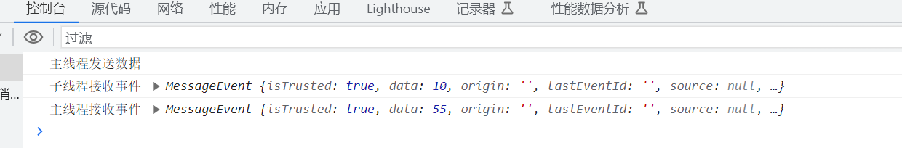

# JavaScript中的事件模型

## 一、事件与事件流

事件流都会经历三个阶段：

- 事件捕获阶段(capture phase)
- 处于目标阶段(target phase)
- 事件冒泡阶段(bubbling phase)

## 二、事件模型

事件模型可以分为三种：

- 原始事件模型（DOM0级）
- 标准事件模型（DOM2级）
- IE事件模型（基本不用）

### DM0

没有统一标准，是浏览器厂商自己开发实现的，大概实在98年左右，出现第一个规范 DOM1级

#### 绑定方式

- HTML代码中直接绑定

```html
<input type="button" onclick="fun()">
```

- JS

```JS
var btn = document.getElementById('.btn');
btn.onclick = fun;
```

  特性

- 绑定速度快

- 只支持冒泡，不支持捕获

- 同一个类型的事件只能绑定一次

#### 删除 `DOM0` 级事件

```JS
btn.onclick = null;
```

### DOM2

#### 事件绑定

```JS
addEventListener(eventType, handler, useCapture);
// 单击事件
obtn.addEventListener("click",function(){
    console.log(123);
},false)
```

#### 事件移除

```js
removeEventListener(eventType, handler, useCapture)
```

参数如下：

- `eventType`指定事件类型(不要加on)
- `handler`是事件处理函数
- `useCapture`是一个`boolean`用于指定是否在捕获阶段进行处理，一般设置为`false`使用冒泡的方式

### event事件对象

```js
e.preventDefault()：阻止标签的默认行为
e.stopPropagation()：阻止事件流的传播
```


--------------------------------------------------------------------------------------------------------------------------------------

[参考原文-在JavaScript中的事件模型如何理解?](https://blog.csdn.net/qq_43299703/article/details/120838866)


# DocumentFragment

以下是一个更实际的案例，在其中我们使用`DocumentFragment`来有效地向`ul`元素中添加多个列表项，而不会频繁地更新DOM：

```js
// 创建一个空的文档片段
const fragment = document.createDocumentFragment();

// 模拟获取数据的函数
function fetchData() {
  return new Promise((resolve) => {
    setTimeout(() => {
      resolve(['Item 1', 'Item 2', 'Item 3', 'Item 4']);
    }, 1000);
  });
}

// 模拟渲染列表项的函数
function renderListItem(text) {
  const li = document.createElement('li');
  li.textContent = text;
  return li;
}

// 获取数据并将列表项添加到文档片段中
fetchData().then((data) => {
  data.forEach((item) => {
    const listItem = renderListItem(item);
    fragment.appendChild(listItem);
  });

  // 将文档片段一次性地插入到DOM中的ul元素中
  const ul = document.getElementById('list');
  ul.appendChild(fragment);
});
```

在上面的示例中，我们模拟了一个异步函数`fetchData()`，用于获取数据。然后，我们使用`forEach`循环遍历数据，并通过`renderListItem()`函数将每个数据项转换为列表项``。然后，我们将列表项逐个添加到文档片段中。

一旦所有列表项都添加到文档片段中，我们一次性将整个文档片段插入到具有id为"list"的`ul`元素中，这样避免了多次更新DOM的开销。


# async和defer属性

```html
<script src="js/jquery-3.4.1.js" defer></script>
<script src="js/jquery-3.4.1.min.js" async></script>
```

```bash
defer
	 1. 解析html
	 2. 遇到带defer属性的script标签，继续解析html，同时下载script引入的文件
	 3. 浏览器完成解析HTML，然后执行下载的脚本（按书写顺序执行）

async
       1. 解析html
       2. 遇到带async属性的script标签。继续解析html，同时下载script引入的文件
       3. js文件下载完毕，浏览器暂停解析html，开始执行js
       4. js执行完毕，浏览器接着解析html

```

# 垃圾回收

基本思路：确定 哪个变量不会再使用，然后释放它占用的内存。这个过程是周期性的， 即垃圾回收程序每隔一定时间（或者说在代码执行过程中某个预定的收 集时间）就会自动运行。

## 标记清理

JavaScript最常用的垃圾回收策略是标记清理（mark-and-sweep）。当变量被使用着会被增加一个使用标记，未被使用了九消除使用标记或者改为清除标记。

## 引用计数

另一种没那么常用的垃圾回收策略是引用计数（reference counting）。 其思路是对每个值都记录它被引用的次数。

但有一个严重的问 题：循环引用。所谓循环引用，就是对象A有一个指针指向对象B，而 对象B也引用了对象A。

## 内存管理

### 优化内存的方式

1. 解除引用：把不需要的数据设置为null
2. 通过const和let声明提升性能：使用这两个新关键字可能会更早地让垃 圾回收程序介入，尽早回收应该回收的内存。
3. 避免内存泄漏：清除不用的定时器；不需要的闭包设置为null；小心意外的全局变量


# web worker

当然，下面是一个简单的Web Workers demo，用于计算斐波那契数列。

在HTML文件中，我们创建一个按钮来触发计算斐波那契数列的操作，并准备一个区域来显示计算结果。

```html
<!DOCTYPE html>
<html>
  <body>
    <button onclick="startWorker()">计算斐波那契数列</button>
    <p id="result"></p>

    <script>
        // 创建Web Worker
        var worker = new Worker("worker.js");

        // 监听Web Worker的消息
        worker.onmessage = function (event) {
            console.log("主线程接收事件",event)
            document.getElementById("result").textContent = event.data;
        };

        // 开始计算
        function startWorker() {
            console.log("主线程发送数据")
            const num =10;
            worker.postMessage(num);
        }
    </script>
  </body>
</html>
```

在同一目录下创建一个名为 “worker.js” 的 JavaScript 文件，其中包含斐波那契数列的计算逻辑。

```js
// 计算斐波那契数列
function fibonacci(n) {
  if (n <= 1) {
    return n;
  }
  return fibonacci(n - 1) + fibonacci(n - 2);
}

// 监听主线程的消息
self.onmessage = function(event) {
  var n = event.data;
  var result = fibonacci(n);
  // 将结果发送回主线程
  self.postMessage(result);
};
```

当点击按钮时，主线程会向Web Worker发送一个数字，Web Worker收到消息后开始计算斐波那契数列，最后将结果发送回主线程。主线程收到消息后，将结果显示在页面上。



# requestAnimationFrame

语法：

```js
requestAnimationFrame(callback)
```

requestAnimationFrame()方法接收一个参数，此参数是一个要在重绘屏幕前调用的函数。每次调用requestAnimationFrame()都会在事件队列上推入一个回调 函数，队列的长度没有限制。

cancelAnimationFrame()  取消任务

刷新频率：一般计算机显示器的屏幕刷新率都 是60Hz，基本上意味着每秒需要重绘60次。大多数浏览器会限制重绘频 率，使其不超出屏幕的刷新率，这是因为超过刷新率，用户也感知不 到。

### 1 通过requestAnimationFrame节流

```js
let requestID = window.requestAnimationFrame(() => {
    console.log('Repaint!');
});
//取消
// window.cancelAnimationFrame(requestID);
```

### 2 解决setInterval()和setTimeout()的不精确

- IE8及更早版本的计时器精度为15.625毫秒； 
- IE9及更晚版本的计时器精度为4毫秒； 
- Firefox和Safari的计时器精度为约10毫秒； 
- Chrome的计时器精度为4毫秒。

mySetTimeout    2秒后输出

```js
function mySetTimeout(callback, time = 3000) {
    let startTime;
    let timer = null;
    // currentTime  表示下次重绘的时间。
    function animate(currentTime) {
        if (!startTime) {
            startTime = currentTime;//记录步数，每个浏览器不一样
        }
        const elapsedTime = currentTime - startTime;
        if (elapsedTime < time) {
            timer = requestAnimationFrame(animate);
            console.log("timer", timer)
        } else {
            callback();
        }
    }
    timer = requestAnimationFrame(animate);

    function cancel() {
        window.cancelAnimationFrame(timer);
    }
    return cancel;
}
let cancel = mySetTimeout(() => {
    console.log('来啦来啦')
}, 2000);
// 取消 
setTimeout(() => {
    cancel();
}, 1000);
```

mySetInterval  1秒间隔输出

```js
function mySetInterval(callback, time = 3000) {
    let startTime;
    // currentTime  表示下次重绘的时间。
    let timer = null;
    function animate(currentTime) {
        if (!startTime) {
            startTime = currentTime;//记录步数，每个浏览器不一样
        }
        const elapsedTime = currentTime - startTime;
        if (elapsedTime < time) {
            timer = requestAnimationFrame(animate);
        } else {
            callback();
            timer = requestAnimationFrame(animate);
            startTime = currentTime;
        }
    }
    // 取消重绘
    function cancel() {
        window.cancelAnimationFrame(timer);
    }
    timer = requestAnimationFrame(animate);
    return cancel;
}
let cancel = mySetInterval(() => {
    console.log('来啦来啦')
}, 1000);
// 取消 
// window.cancelAnimationFrame(timer);
setTimeout(() => {
    cancel();
}, 5000)
```


# end


